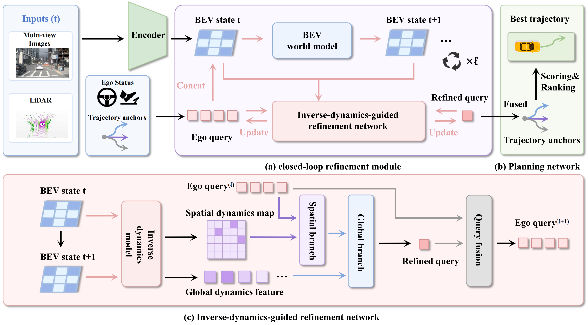

<div align="center">

<h1>🚘 IDOL: Inverse-Dynamics-Guided Future Prediction for End-to-End Autonomous Driving</h1>


<p>
  
  
  
</p>

<p>
  
</p>

</div>

IDOL is a NAVSIM planner that turns latent BEV futures into trajectory updates through inverse dynamics. This repo includes training, evaluation, visualization, and submission scripts.

## 📊 Results


###  NAVSIM v1 navtest

| Method | Input | NC | DAC | TTC | Comfort | EP | PDMS |
|---|---|---:|---:|---:|---:|---:|---:|
| IDOL | C&L | 98.7 | 97.7 | 95.5 | 100.0 | 84.0 | 90.0 |

###  NAVSIM v2 navtest

| Method | NC | DAC | DDC | TLC | EP | TTC | LK | HC | EC | EPDMS |
|---|---:|---:|---:|---:|---:|---:|---:|---:|---:|---:|
| IDOL | 98.8 | 97.6 | 99.5 | 99.8 | 87.1 | 98.3 | 96.3 | 98.3 | 85.5 | 89.6 |

###  NAVSIM v2 navhard stage-1

| Method | NC | DAC | DDC | TLC | EP | TTC | LK | HC | EC | EPDMS |
|---|---:|---:|---:|---:|---:|---:|---:|---:|---:|---:|
| IDOL | 97.2 | 89.6 | 98.0 | 99.6 | 82.3 | 96.9 | 95.3 | 97.6 | 72.9 | 76.2 |

###  NAVSIM v2 navhard two-stage

| Stage | NC | DAC | DDC | TLC | EP | TTC | LK | HC | EC |
|---|---:|---:|---:|---:|---:|---:|---:|---:|---:|
| Stage 1 | 97.2 | 89.6 | 98.0 | 99.6 | 82.3 | 96.9 | 95.3 | 97.6 | 72.9 |
| Stage 2 | 84.9 | 81.7 | 87.7 | 98.5 | 84.7 | 81.1 | 50.0 | 95.4 | 64.0 |

**Final EPDMS: 38.0**

## 🗂️ Repository Layout

```text
assets/                         Figures and project assets
docs/                           NAVSIM reference notes
download/                       Dataset download helpers
navsim/agents/IDOL/             IDOL agent, model, losses, features, targets
navsim/planning/script/         Hydra entrypoints
scripts/training/               Training scripts
scripts/evaluation/             Evaluation, cache, visualization, submission scripts
tools/                          Utilities
tutorial/                       NAVSIM visualization tutorial
```

## ⚙️ Environment

```bash
conda env create -f environment.yml
conda activate IDOL
pip install -r requirements.txt
```

Install the nuPlan devkit version required by NAVSIM, then set paths:

```bash
export NUPLAN_MAP_VERSION="nuplan-maps-v1.0"
export NUPLAN_MAPS_ROOT="$(pwd)/dataset/maps"
export NAVSIM_EXP_ROOT="$(pwd)/exp"
export NAVSIM_DEVKIT_ROOT="$(pwd)"
export OPENSCENE_DATA_ROOT="$(pwd)/dataset"
```

## 🗄️ Data

Download data and maps:

```bash
bash download/download_maps.sh
bash download/download_navtrain.sh
bash download/download_test.sh
```

Prepare trajectory anchors and PDM scores:

```bash
mkdir -p dataset/extra_data/planning_vb
python scripts/miscs/k_means_trajs.py
bash scripts/miscs/gen_pdm_score.sh
```

Expected files:

```text
dataset/extra_data/planning_vb/trajectory_anchors_256.npy
dataset/extra_data/planning_vb/formatted_pdm_score_256.npy
```

Build the metric cache before evaluation:

```bash
bash scripts/evaluation/run_metric_caching.sh
```

## 🔁 Training

```bash
ROOT_DIR="$(pwd)" bash scripts/training/run_IDOL.sh
```

Default recipe:

```text
Hardware: 4 NVIDIA RTX 3090 GPUs
Per-GPU batch size: 4
Epochs: 30
Config: navsim/agents/IDOL/configs/default.py
```

Override `ROOT_DIR`, `NUM_GPUS`, `BATCH_SIZE`, `MAX_EPOCHS`, or `ACCUMULATE_GRAD_BATCHES` as needed.

## ✅ Evaluation

NAVSIM v1 / PDMS:

```bash
ROOT_DIR="$(pwd)" \
CKPT_DIR=/path/to/lightning_logs/version_x/checkpoints \
bash scripts/evaluation/eval_IDOL.sh
```

NAVSIM v2 navtest / EPDMS:

```bash
ROOT_DIR="$(pwd)" bash scripts/evaluation/run_metric_caching_navtest_epdms_v2.sh
ROOT_DIR="$(pwd)" \
CHECKPOINT_PATH=/path/to/checkpoint.ckpt \
bash scripts/evaluation/run_IDOL_navtest_epdms_v2.sh
```

NAVSIM v2 navhard / two-stage EPDMS:

```bash
ROOT_DIR="$(pwd)" \
CHECKPOINT_PATH=/path/to/checkpoint.ckpt \
LTF_CHECKPOINT_PATH=/path/to/ltf_checkpoint.ckpt \
bash scripts/evaluation/run_IDOL_navhard_epdms_v2.sh
```

## 🎨 Visualization

```bash
ROOT_DIR="$(pwd)" \
CHECKPOINT_PATH=/path/to/checkpoint.ckpt \
bash scripts/evaluation/run_IDOL_visualization.sh
```

Figures are saved to `${NAVSIM_EXP_ROOT}/visualization/IDOL/`.
